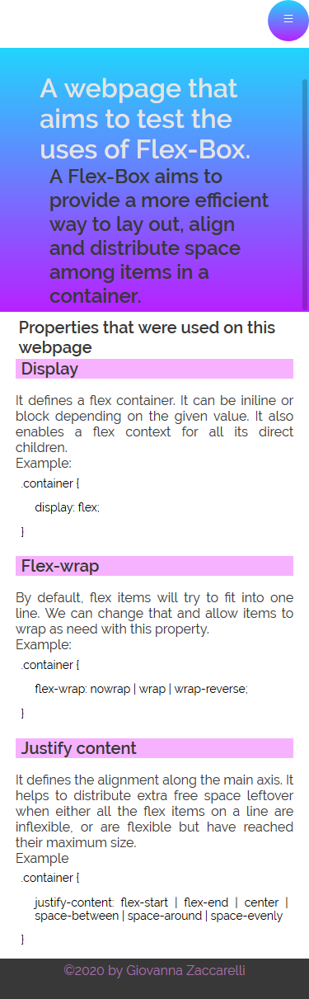

# FLEX-BOX STUDIES

### Simple webpage that was used to a basic review of *Flex-box* and tests made with it.
#### The building of the page was also used for a review about responsivity. 

<h1 align="center">DEVICES</h1>
<h1 align="center">WIDE SCREEN</h1>

  

<h1 align="center">MEDIUM SCREEN</h1>

  

<h1 align="center">SMALL SCREEN</h1>

  
 

